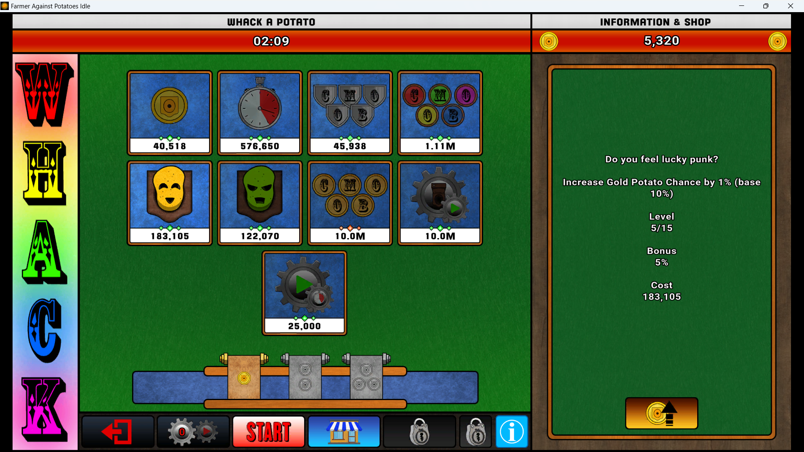
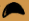

# 🥔 FAPI Whack-A-Potatoe

There is a Steam game called [Farmer Against Potatoes Idle](https://store.steampowered.com/app/1535560/Farmer_Against_Potatoes_Idle/), and it contains a game just like the old "whack-a-mole", but with potatoes!

The game is pretty straighforward, there are 2 "good" potatoes that give you points, and 2 "bad" ones that take your points. This script checks for good potatoes on your **primary** screen and clicks them as fast as possible.

## 📃 Topics
- [🥔 FAPI Whack-A-Potatoe](#-fapi-whack-a-potatoe)
  - [📃 Topics](#-topics)
  - [⚠️ Important info](#️-important-info)
  - [🚀 How to use the script](#-how-to-use-the-script)
  - [🧑‍💻 How it works](#-how-it-works)


## ⚠️ Important info

The script uses confidence factors, such as if the colors are similar, if the pixels are similar, but it also takes size into account! And because of this, you may have issues if your screen isn't 1920x1080. What I suggest if that is the case:
- Go to the potatoes game, then to the store

> 

- Take a screenshot of the eye of the yellow potato, just like this:

- Replace the eye image inside img/eye.png with the one you made.
- Now the resolution should be the same, so the script will work properly.

## 🚀 How to use the script

First of all, you need python for this, so download it first.
Then execute the following command to install the needed libraries:
```shell
pip install pyautogui keyboard
```
Once they are installed you can do the following:
- go to a terminal
- find the script folder inside the terminal
  - [How to enter folders in CMD - Windows](https://www.lifewire.com/change-directories-in-command-prompt-5185508)
  - [Entering Folders with Terminal - MacOS / Linux](https://sourcedigit.com/27411-how-to-open-a-directory-in-linux-using-terminal/)
- execute this command to run the script:
```shell
python script.py
```
It will start the script and say the keybindings to start and stop.
It starts as **STOPPED** by default, so you just need to press the start key for it to start clicking those potatoes. And when you're not using, just press the stop key.

If you want to stop the script entirely, go into the terminal you used to start the program and press `Ctrl + C`, it will shutdown the process.

## 🧑‍💻 How it works

The script uses mainly `PyAutoGUI` to handle the image search and screen clicks. It basically takes a screenshot of a specific region often as possible and searches for a specific image inside that screenshot _(our eye.png)_ takin color and other factors into account.

But because the confidence isn't 100%, it will allow the image to be true even if some small things are different, so after some testing 0.8 is a good value because it can find normal potatoes and the special ones aswell, while not clicking green or red ones.

It also uses the `keyboard` library to handle keyboard presses, because having to `Ctrl + C` while your mouse is clicking everywhere is not a good idea... Instead when you press a specific key _(f8 by default)_ it will start or stop the script.

There are multiple images in the img folder because they might be useful incase you're doing extra automations, for example automatically starting the round when the timer reaches to 0.